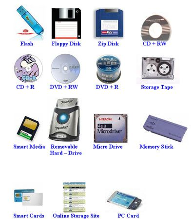
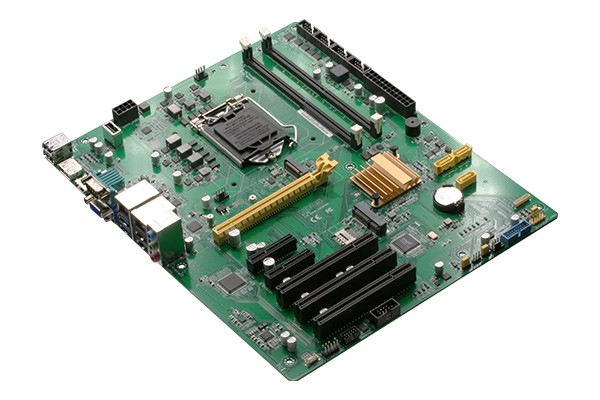
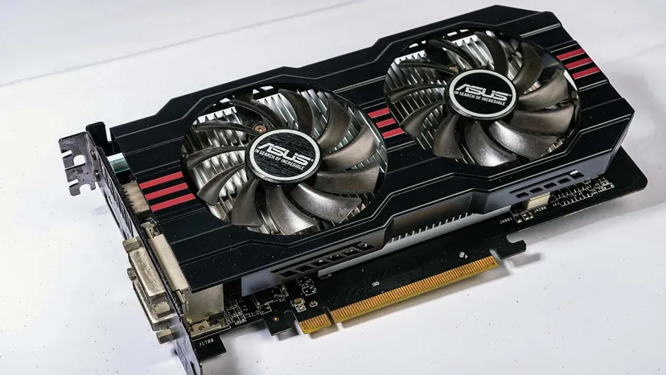
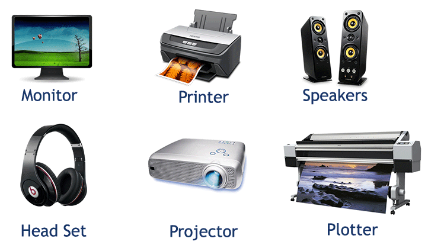
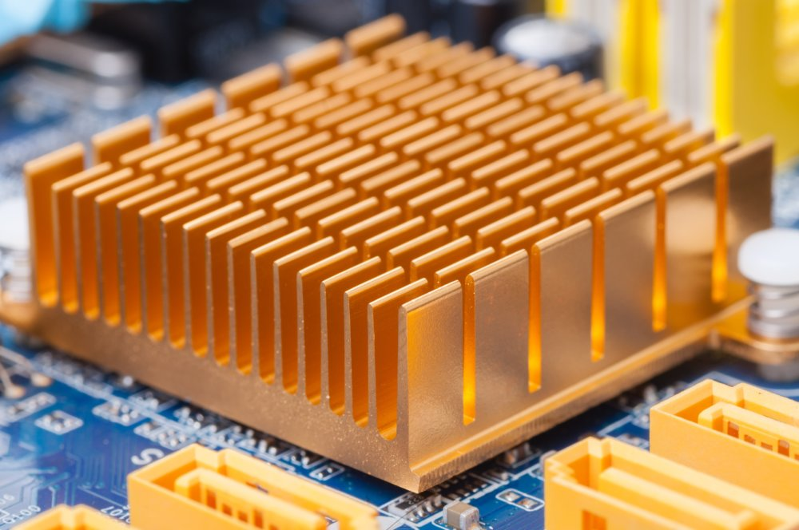
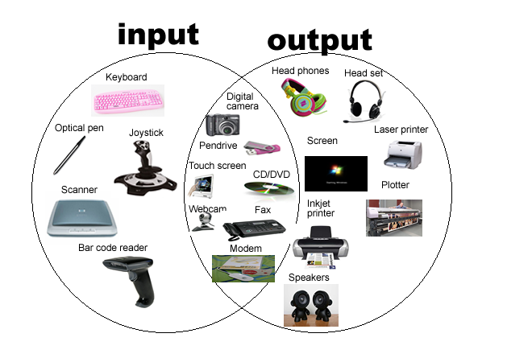

**Computer:**
A computer is a programmable electronic device that processes and stores data. It is designed to perform various tasks by executing a set of instructions called programs. Computers come in various forms, including personal computers, servers, mainframes, and embedded systems in devices like smartphones and appliances. The basic components of a computer system include hardware, software, data, and the user.

**Software:**
Software is a set of instructions, programs, or data that enables a computer to perform specific tasks or functions. It is a non-physical component of a computer system that provides the necessary instructions for the hardware to operate and execute various operations. Software can be broadly categorized into two main types:

1. **System Software:**
   - **Operating Systems (OS):** Software that manages computer hardware and provides services for computer programs. Examples include Windows, macOS, Linux.
   - **Device Drivers:** Software that allows the operating system to communicate with hardware devices like printers, graphics cards, etc.
   - **Utilities:** Programs that perform specific tasks related to system management, such as antivirus software, disk cleanup tools, etc.

2. **Application Software:**
   - **Applications:** Programs designed to perform specific tasks for end-users. Examples include word processors (Microsoft Word), spreadsheets (Microsoft Excel), web browsers (Google Chrome), and games.
   - **Business Software:** Tools designed for business purposes, such as accounting software, customer relationship management (CRM) software, etc.
   - **Creative Software:** Tools used for creative tasks, such as graphic design software (Adobe Photoshop), video editing software (Adobe Premiere), and music production software.

**Hardware:**
Hardware refers to the physical components of a computer system that you can touch and see. These components are essential for the computer to function and execute tasks. Hardware includes devices such as the central processing unit (CPU), memory (RAM), storage devices (hard drives, SSDs), input devices (keyboard, mouse), output devices (monitor, printer), and various other peripherals like graphics cards, network cards, and motherboards. In essence, hardware provides the tangible infrastructure necessary for the execution of software and the processing of data within a computer system.

Computer hardware consists of various physical components that work together to enable the functioning of a computer system. Here are the main components of computer hardware:

1. **Central Processing Unit (CPU):**
   - Often referred to as the brain of the computer.
   - Executes instructions and performs calculations.
   - Comprises components like the Control Unit, Arithmetic Logic Unit (ALU), and registers.

2. **Memory (RAM - Random Access Memory):**
   - Provides temporary storage for data and program instructions that the CPU is currently using.
   - Data in RAM is volatile and is lost when the computer is powered off.

3. **Storage Devices:**
   - **Hard Disk Drive (HDD):** Provides long-term, non-volatile storage for the operating system, software, and user data.
   - **Solid State Drive (SSD):** Similar to an HDD but uses flash memory for faster data access.
   - **Optical Drives (e.g., CD/DVD/Blu-ray):** Used for reading and writing optical discs.

4. **Motherboard:**
   - The main circuit board that houses the CPU, memory, and connects other peripheral devices.
   - Provides interfaces for various components to communicate with each other.

5. **Power Supply Unit (PSU):**
   - A switched-mode power supply (SMPS) is an electronic circuit that converts power using switching devices that are turned on and off at high frequencies, and storage components such as inductors or capacitors to supply power when the switching device is in its non-conduction state.
   - It supplies power to the motherboard, CPU, and other components.

6. **Graphics Processing Unit (GPU):**
   - Responsible for rendering graphics and images.
   - Often used in conjunction with a CPU to enhance graphical performance, especially in gaming and multimedia applications.

7. **Input Devices:**
   - **Keyboard:** Allows users to input text and commands.
   - **Mouse/Touchpad:** Enables pointing and clicking.
   - **Scanner:** Converts physical documents or images into digital format.

8. **Output Devices:**
   - **Monitor/Display:** Displays visual output.
   - **Printer:** Produces a hard copy of documents.
   - **Speakers:** Outputs audio.

9. **Networking Components:**
   - **Network Interface Card (NIC):** Facilitates communication over a network.
   - **Router:** Manages network traffic and connects the computer to the internet or other networks.

10. **Expansion Cards:**
    - **Graphics Card:** Enhances graphical capabilities.
    - **Sound Card:** Improves audio output.

11. **Cooling Systems:**
    - **Fans/Heat Sinks:** Prevents overheating of components, especially the CPU and GPU.

12. **Cables and Connectors:**
    - Various cables and connectors to link different components.

13. **Peripheral Devices:**
    - Devices that connect to the computer to provide additional functionality, such as printers, scanners, and external storage devices.

**SMPS (Switched-Mode Power Supply):**

A Switched-Mode Power Supply (SMPS) is a type of power supply that efficiently converts electrical power from one form to another using switching devices. It is widely used in electronic devices, computers, and other applications where a stable and regulated power supply is essential. Here are the key aspects of an SMPS:

1. **Switching Operation:**
   - The core principle of an SMPS is the use of electronic switches (transistors) to rapidly switch the input voltage on and off.
   - This high-frequency switching allows for efficient transformation of electrical power.

2. **Stages of Operation:**
   - **Rectification:** Converts the incoming alternating current (AC) into direct current (DC).
   - **Filtering:** Smoothens the DC waveform by reducing ripple and noise.
   - **Switching:** Uses electronic switches to chop the DC voltage into high-frequency pulses.
   - **Transformation:** Transforms the high-frequency pulses into the desired output voltage using an inductor and transformer.
   - **Rectification (Output):** Converts the high-frequency AC back to DC at the desired output voltage.
   - **Filtering (Output):** Further filters the output to reduce any remaining ripple.

3. **Advantages of SMPS:**
   - **Efficiency:** SMPS is more efficient compared to traditional linear power supplies because it minimizes energy loss in the form of heat.
   - **Compact Size:** SMPS units are generally smaller and lighter than their linear counterparts, making them suitable for compact electronic devices.
   - **Variable Output Voltage:** The output voltage of an SMPS can be easily adjusted, making it versatile for different applications.
   - **Regulated Output:** SMPS provides a stable and regulated output voltage even with variations in the input voltage.

4. **Applications:**
   - SMPS is used in a wide range of electronic devices, including computers, laptops, TVs, audio amplifiers, and other consumer electronics.
   - It is commonly employed in situations where efficiency, compact size, and regulated power are crucial.

5. **Types of SMPS:**

   - **Buck Converter:** Reduces voltage.
   - **Boost Converter:** Increases voltage.
   - **Buck-Boost Converter:** Can step up or step down voltage.

**Processor (Central Processing Unit - CPU):**

The processor, also known as the Central Processing Unit (CPU), is a vital component of a computer system responsible for executing instructions and performing calculations. It acts as the "brain" of the computer, carrying out tasks and managing data within the system. Here are detailed aspects of a processor:

1. **Function:**
   - **Execution of Instructions:** The primary role of the CPU is to execute instructions stored in the computer's memory. These instructions come from software applications and the operating system.
   - **Arithmetic and Logic Operations:** The CPU performs arithmetic calculations (addition, subtraction, multiplication, division) and logical operations (comparisons) necessary for program execution.

2. **Components:**
   - **Control Unit (CU):** Manages the flow of data and instructions within the CPU and coordinates operations with other hardware components.
   - **Arithmetic Logic Unit (ALU):** Performs arithmetic and logical operations on data.
   - **Registers:** Small, fast storage locations within the CPU used for temporary data storage during processing. Registers include the instruction register, data register, and address register.

3. **Clock Speed:**
   - **Clock Rate:** Measured in Hertz (Hz), it represents the number of cycles per second the CPU can execute. A higher clock speed generally indicates faster processing. Modern CPUs have multi-core architectures, allowing them to handle multiple tasks simultaneously.

4. **Cache Memory:**
   - **L1, L2, L3 Caches:** These are small-sized, high-speed memory units located on or near the CPU die. They store frequently used instructions and data to reduce the time it takes to fetch information from the slower main memory (RAM).

5. **Instruction Set:**
   - **ISA (Instruction Set Architecture):** The set of instructions that a CPU can execute. Different CPUs may have different instruction sets, and this influences software compatibility and performance.

6. **Pipelines:**
   - **Instruction Pipeline:** The CPU uses a pipeline architecture to efficiently process multiple instructions simultaneously. Instructions move through stages (fetch, decode, execute) in a pipeline fashion.

7. **Multithreading and Parallel Processing:**
   - **Multithreading:** Some CPUs support simultaneous execution of multiple threads, allowing for better utilization of resources and improved performance in multitasking scenarios.
   - **Parallel Processing:** In systems with multiple CPUs or cores, parallel processing enables the simultaneous execution of multiple instructions or tasks.

8. **Compatibility and Architecture:**
   - **x86, x64, ARM, etc.:** Different processor architectures exist, each with its own set of instructions and design principles. Common architectures include x86 (used in many desktop and laptop CPUs) and ARM (common in mobile devices and embedded systems).

