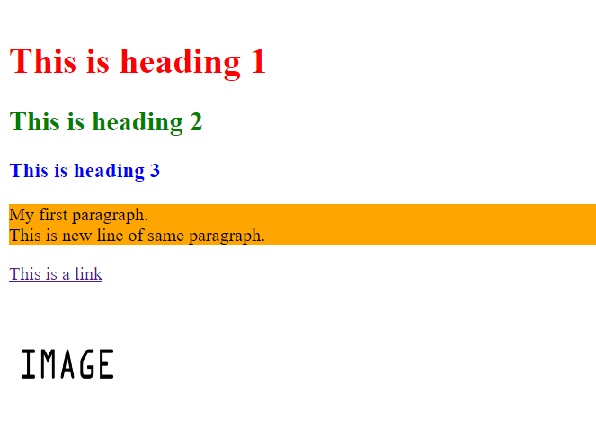

# Website Basics

**HTML (Hypertext Markup Language)**
HTML is the standard markup language used to create web pages. It provides the structure for web content by using a system of tags and attributes. HTML elements are used to define the different parts of a webpage, such as headings, paragraphs, images, links, and more.

## Basic html stucture

The basic structure of an HTML document consists of several elements that define the different parts of a webpage. Here's a simple example of a basic HTML structure:

```html
<!DOCTYPE html>
<html>
  <head>
    <title>Page Title</title>
  </head>
  <body>
    <h1>This is a Heading</h1>
    <p>This is a paragraph.</p>
  </body>
</html>
```

Let's break down each part:

1. `<!DOCTYPE html>`: This declaration specifies the document type and version of HTML (in this case, HTML5).

2. `<html>`: This element is the root element of an HTML page and contains all other elements.

3. `<head>`: This element contains meta-information about the document, such as the title of the page, links to external resources (e.g., CSS files), and scripts.

4. `<title>`: This element sets the title of the webpage, which appears in the browser tab.

5. `<body>`: This element contains the content of the webpage, such as headings, paragraphs, images, links, and other elements.

6. `<h1>`: This is a heading element, used to define the main heading of the page. HTML provides six levels of headings, `<h1>` to `<h6>`, with `<h1>` being the most important and `<h6>` the least important.

7. `<p>`: This is a paragraph element, used to define a paragraph of text.

This is a very basic example, but it demonstrates the fundamental structure of an HTML document. As you learn more about HTML, you'll discover many other elements and attributes that you can use to create rich and interactive web pages.

## CSS (Cascading Style Sheets):

CSS is used to style the visual presentation of HTML elements on a webpage. It allows you to control the layout, colors, fonts, and other design aspects of a webpage. CSS works by selecting HTML elements and applying styles to them using selectors and declarations.

**Types of CSS:**

1. **Inline CSS:** Inline CSS is applied directly to an HTML element using the `style` attribute. For example:

   ```html
   <p style="color: red;">This is a paragraph with red text.</p>
   ```

2. **Internal CSS:** Internal CSS is placed within the `<style>` element in the head section of an HTML document. It applies styles to the entire webpage. For example:

   ```html
   <head>
     <style>
       body {
         font-family: Arial, sans-serif;
         background-color: #f0f0f0;
       }
       h1 {
         color: blue;
       }
     </style>
   </head>
   ```

3. **External CSS:** External CSS is stored in a separate CSS file and linked to an HTML document using the `<link>` element. This allows you to apply styles across multiple web pages. For example:
   ```html
   <head>
     <link rel="stylesheet" type="text/css" href="styles.css" />
   </head>
   ```
   The `styles.css` file:
   ```css
   body {
     font-family: Arial, sans-serif;
     background-color: #f0f0f0;
   }
   h1 {
     color: blue;
   }
   ```

Using CSS, you can create visually appealing and responsive web pages by controlling the layout and design of your content.

## Javascript

**JavaScript:**
JavaScript is a programming language that is used to add interactivity and dynamic behavior to web pages. It can be used to create interactive forms, validate user input, manipulate the DOM (Document Object Model), and more.

JavaScript is a versatile programming language that is primarily used to add interactivity to web pages. Here are some basics of JavaScript:

1. **Variables:** You can use variables to store data values. Variables can be declared using the `var`, `let`, or `const` keywords. For example:

   ```javascript
   var x = 5;
   let y = 10;
   const z = 15;
   ```

2. **Data Types:** JavaScript has several data types, including numbers, strings, booleans, arrays, objects, and more. For example:

   ```javascript
   var num = 5;
   var str = "Hello, world!";
   var bool = true;
   var arr = [1, 2, 3];
   var obj = { key: "value" };
   ```

3. **Operators:** JavaScript supports various operators, such as arithmetic, assignment, comparison, logical, and more. For example:

   ```javascript
   var sum = 5 + 10;
   var isGreater = 10 > 5;
   ```

4. **Functions:** Functions in JavaScript are blocks of code that can be called and executed. They can take inputs (parameters) and return outputs. For example:

   ```javascript
   function greet(name) {
     return "Hello, " + name + "!";
   }
   console.log(greet("Alice")); // Output: Hello, Alice!
   ```

5. **Conditionals:** JavaScript supports conditional statements like `if`, `else if`, and `else` to execute different code based on different conditions. For example:

   ```javascript
   var num = 10;
   if (num > 0) {
     console.log("Positive");
   } else if (num < 0) {
     console.log("Negative");
   } else {
     console.log("Zero");
   }
   ```

6. **Loops:** JavaScript provides different types of loops, such as `for`, `while`, and `do-while`, to execute code repeatedly. For example:

   ```javascript
   for (var i = 0; i < 5; i++) {
     console.log(i);
   }
   ```

7. **Events:** JavaScript can respond to user actions (events) on a web page. You can use event listeners to handle these events. For example:
   ```javascript
   document.getElementById("myButton").addEventListener("click", function () {
     console.log("Button clicked!");
   });
   ```

**Learn more about Html,CSS and Javascript [here](https://www.w3schools.com/)**

## Questions:

### Write a basic HTML file to display the following layout (use external CSS only with the file ame “style.css”).

Heading 1 color = red
Heading 2 color=green
Heading 3 Color = blue
Paragraph background color= orange
Link for anchor text =https://google.com
Image source = “image.jpg”
And alt text is=” Google”
Assume anything else if needed.



### Solution

create a html file with file name "index.html".

```html
<!DOCTYPE html>
<html>
  <head>
    <link rel="stylesheet" type="text/css" href="style.css">
  </head>
<br>

<h1>This is heading 1</h1>
<h2>This is heading 2</h2>
<h3>This is heading 3</h3>
<p>My first paragraph.<br/> This is new line of same paragraph.</p>

<a href="https://google.com">This is a link</a><br/>

</body>
</html>

```

Create a css file on the same folder with file name “style.css” and add the following code.

```css  
h1 {
  color: red;
}
h2 {
  color: green;
}
h3 {
  color: blue;
}
p {
  background-color: orange;
}

```
